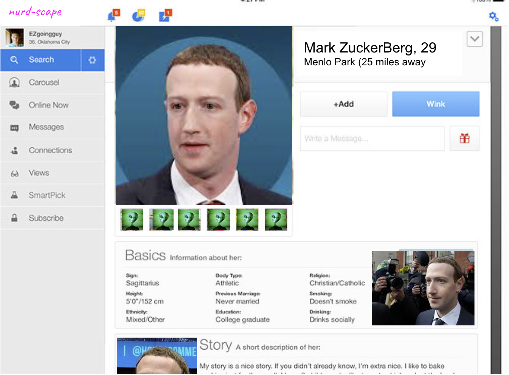

# Tech-Tinder-Front

## A dating app for losers in tech

## Date: 08/10/2022

#### By: Avery Novick, Jason Martinez, Matt Scott

<a href="" target="_blank" rel="noreferrer">Deployed Website</a>

---

---

### _Description_

For a full stack PERN application. This is a mock dating app for individuals who are in tech.

---

### Project Overview

---

### Getting Started

Once you fork and clone the repo:

    1.   npm i

### Screenshots

    <pre>
        &nbsp;&nbsp;&nbsp;&nbsp;&nbsp;&nbsp;&nbsp;&nbsp;&nbsp;&nbsp;&nbsp;&nbsp;
    </pre>

---

### _Technologies Used_

- React.js
- Postgres
- Sequelize
- Javascript
- Node.js
- CSS
- HTML
- Heroku

---

#### _Future Updates_

- [ ] Allow users to dm each other

---

#### **_Resources_**

##### [Frontend GitHub Link](https://github.com/anovick1/Tech-Tinder-Backend)

##### [Trello Link](https://trello.com/b/1tj4Ue40/tech-harmony-full-stack-pern)
