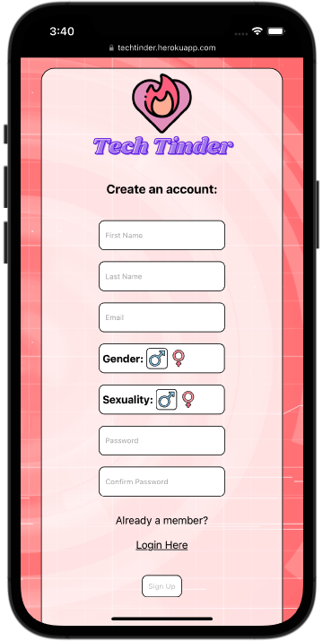
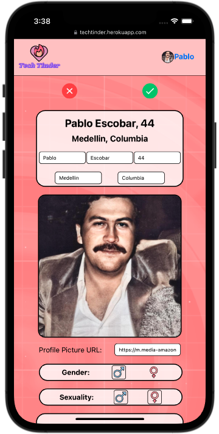
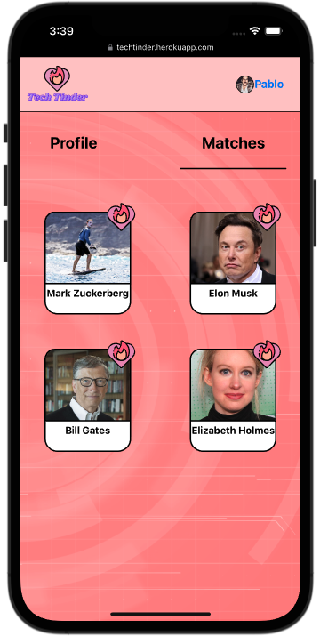

# Front End

## A dating app for losers in tech

## Date: 08/10/2022

---

### Avery Novick: <a href="https://www.linkedin.com/in/avery-novick/" target="_blank" rel="noreferrer">LinkedIn</a>, <a href="https://github.com/anovick1" target="_blank" rel="noreferrer">GitHub</a>

### Jason Martinez: <a href="https://www.linkedin.com/in/matthew-scott95/" target="_blank" rel="noreferrer">LinkedIn</a>, <a href="github.com/jasonmar08" target="_blank" rel="noreferrer">GitHub</a>

### Matt Scott: <a href="linkedin.com/in/martinez-jason" target="_blank" rel="noreferrer">LinkedIn</a>, <a href="https://github.com/gr8tscott" target="_blank" rel="noreferrer">GitHub</a>

---

## <a href="https://techtinder.herokuapp.com/" target="_blank" rel="noreferrer">Deployed Website</a>

---

## Description

For a full stack application using PostgreSQL, Express.js, React, Node.js (PERN) . This is a mock dating app for individuals who are in tech.

---

## Getting Started

Once you fork and clone the repo:

    1.   npm i

---

## Screenshots

#### Mobile Version

    <pre>
        &nbsp;&nbsp;&nbsp;&nbsp;&nbsp;&nbsp;&nbsp;&nbsp;&nbsp;&nbsp;&nbsp;&nbsp;
    </pre>

#### Browser Version

    <pre>
        &nbsp;&nbsp;&nbsp;&nbsp;&nbsp;&nbsp;&nbsp;&nbsp;&nbsp;&nbsp;&nbsp;&nbsp;
    </pre>

---

## Technologies Used

- React.js
- Postgres
- Sequelize
- Javascript
- Node.js
- CSS
- HTML
- Heroku

---

## Future Updates

- [ ] Allow users to dm each other
- [ ] Allow users to change password
- [ ] Allow users to delete a like

---

### **_Resources_**

##### [Backend GitHub Link](https://github.com/anovick1/Tech-Tinder-Backend)

##### [Trello Link](https://trello.com/b/1tj4Ue40/tech-harmony-full-stack-pern)
